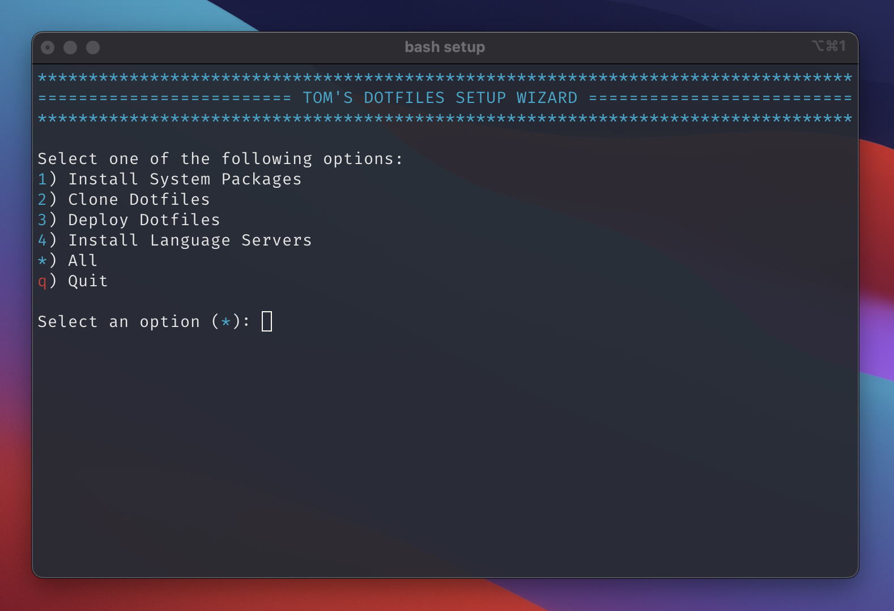

<div align="center">
  <h1><a href="https://tomkonidas.github.io/dotfiles">dotfiles</a></h1>

  <a href="https://github.com/tomkonidas/dotfiles/blob/main/LICENSE">
    
  </a>

  <a href="https://github.com/tomkonidas/dotfiles/pulse">
    
  </a>

  <a href="https://github.com/tomkonidas/dotfiles/stargazers">
    
  </a>

  <a href="https://github.com/tomkonidas?tab=followers">
    
  </a>
</div>

## Setup

**You can download and run the setup script with this 1 liner:**

```sh
bash <(curl -sS https://raw.githubusercontent.com/tomkonidas/dotfiles/main/setup)
```

<div align="center">
  <figure>
    
    <br>
    <figcaption>Terminal screenshot</figcaption>
  </figure>
</div>

## Contact

Created by [@tomkonidas](https://tomkonidas.com) - feel free to contact me!
