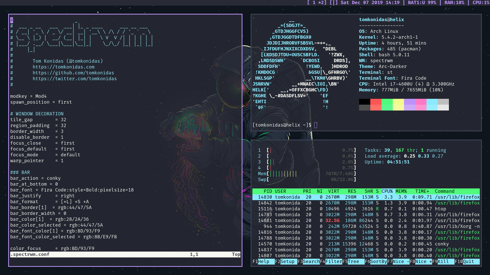

# dotfiles

## Details
+ **OS**: Arch Linux
+ **WM**: spectrwm
+ **Shell**: bash
+ **Bar**: Built-in spectrwm bar (with conky)
+ **Terminal**: st
+ **Font**: Fira Code
+ **Editor**: Neovim
+ **Browser**: Firefox
+ **Theme**: Arc-Dark
+ **Colors**: Dracula



## Fresh Install
```bash
git clone --bare https://bitbucket.org/durdn/cfg.git $HOME/.cfg
function config {
   /usr/bin/git --git-dir=$HOME/.cfg/ --work-tree=$HOME $@
}
mkdir -p .config-backup
config checkout
if [ $? = 0 ]; then
  echo "Checked out config.";
  else
    echo "Backing up pre-existing dot files.";
    config checkout 2>&1 | egrep "\s+\." | awk {'print $1'} | xargs -I{} mv {} .config-backup/{}
fi;
config checkout
config config status.showUntrackedFiles no
```
